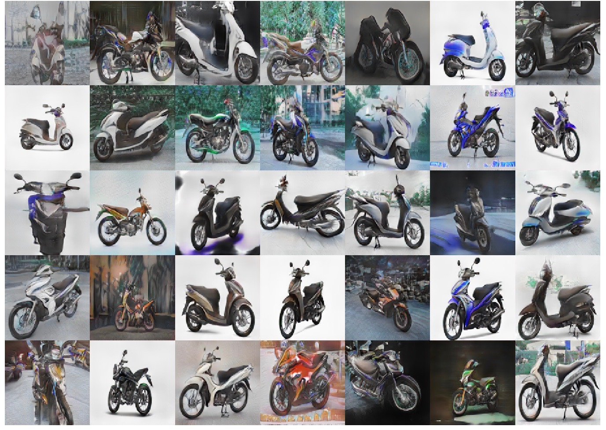

# MotorbikeGeneration

My presentation:
https://docs.google.com/presentation/d/1m5MiT3a4T8RBo4V9-S40UaVR-HeFFq2Ly3-U8I9u0uI/edit?usp=sharing

## Installation
``` bash
./on_startup.sh
```

## Model
```
chmod +x scripts/*.sh
./scripts/run_[name experiment].sh
```

## Result images




## Failed cases


